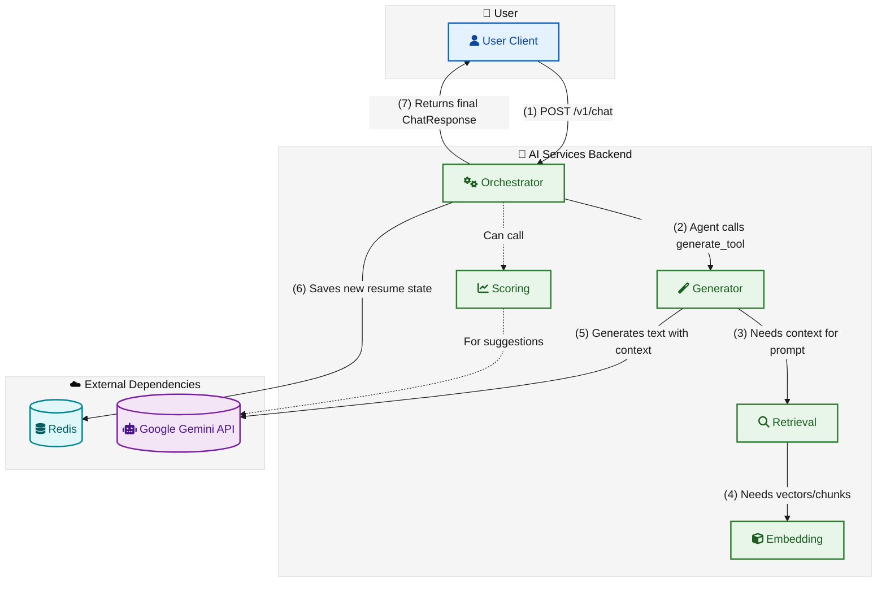

# 🚀 CVisionary AI Services

[](https://www.python.org/)
[](https://fastapi.tiangolo.com/)
[](https://www.docker.com/)
[](LICENSE)
[](https://github.com/psf/black)
[](https://github.com/yourusername/cvisionary/actions)
[](https://codecov.io/gh/yourusername/cvisionary)

> **CVisionary AI Services** is a powerful, microservice-based backend platform that powers intelligent resume generation, analysis, and optimization. Built with modern Python and FastAPI, it leverages Google's Gemini AI models to deliver professional, ATS-optimized resumes tailored to specific job descriptions.

## 📋 Table of Contents

- [✨ Core Features](#-core-features)
- [🏗️ System Architecture](#%EF%B8%8F-system-architecture)
- [🚀 Getting Started](#-getting-started)
  - [Prerequisites](#-prerequisites)
  - [Quick Start with Docker](#-quick-start-with-docker)
  - [Local Development Setup](#-local-development)
- [🧪 Testing](#-testing)
- [📚 API Documentation](#-api-documentation)
- [🏗️ Project Structure](#%EF%B8%8F-project-structure)
- [🤝 Contributing](#-contributing)
- [📄 License](#-license)

## ✨ Core Features

- **🤖 AI-Powered Resume Generation**: Create professional, tailored resumes using advanced language models
- **🎯 ATS Optimization**: Get real-time resume scoring against job descriptions
- **🧠 Context-Aware Suggestions**: Receive intelligent, context-specific improvement recommendations
- **⚡ High Performance**: Built with FastAPI and async support for optimal performance
- **🔍 Semantic Search**: Advanced retrieval capabilities for relevant content suggestions
- **📊 Analytics & Insights**: Detailed feedback on resume strength and areas for improvement
- **🔒 Secure & Private**: Your data remains yours - we prioritize data privacy and security
- **🛠️ Extensible Architecture**: Modular design for easy maintenance and feature additions
-   **Semantic Search & Retrieval**: Converts user profile data into vector embeddings for fast, context-aware information retrieval.
-   **ATS-Style Scoring**: Analyzes resumes against job descriptions to provide a match score and identify keyword gaps.
-   **Actionable Suggestions**: Offers concrete, AI-generated tips for improving resume content.
-   **Microservice Architecture**: A decoupled, scalable, and maintainable system where each service has a single responsibility.

## 🏗️ System Architecture

CVisionary's architecture is built around a microservices pattern, ensuring scalability, maintainability, and clear separation of concerns. The system is composed of five core microservices and a Redis instance for state management.

### High-Level Overview



### 🛠️ Services Breakdown

| Service | Port | Responsibility | Key Technologies |
|---------|------|----------------|------------------|
| **Orchestrator** | `8080` | Acts as the central brain, managing user sessions, interpreting requests, and coordinating between services. Implements the LangChain agent with tool calling capabilities. | FastAPI, LangChain, Google Gemini, Redis, Pydantic |
| **Generator** | `8000` | Specialized in generating high-quality, structured resume content. Transforms user inputs into professional resume sections. | FastAPI, Google Gemini, Jinja2, Pydantic |
| **Retrieval** | `8002` | Provides semantic search capabilities over user data and resume content. Handles context retrieval for personalized suggestions. | FastAPI, FAISS, Sentence Transformers, SQLAlchemy |
| **Embedding** | `8001` | Manages text embeddings, converting resume content and job descriptions into vector representations. | FastAPI, Sentence Transformers, FAISS |
| **Scoring** | `8004` | Analyzes resume content against job descriptions, providing ATS compatibility scores and improvement suggestions. | FastAPI, Scikit-learn, NLTK, Pydantic |
| **Redis** | `6379` | Serves as the in-memory data store for session management, caching, and real-time data access. | Redis, RedisJSON |

### 🔄 Data Flow

1. **User Request Handling**:
   - Frontend sends user requests to the Orchestrator service
   - Orchestrator validates the session and processes the request

2. **Content Generation**:
   - For resume generation/editing, Orchestrator calls the Generator service
   - Generator may retrieve relevant context via the Retrieval service

3. **Scoring & Analysis**:
   - Scoring service evaluates resume content against job descriptions
   - Provides detailed feedback and improvement suggestions

4. **State Management**:
   - All session state is persisted in Redis
   - Enables stateless service design and horizontal scaling

## 🚀 Getting Started

This section will guide you through setting up the CVisionary AI Services in your local development environment. We'll cover both Docker-based deployment for production-like environments and local development setup for contributors.

### 🛠 Prerequisites

Before you begin, ensure you have the following installed on your system:

- **Docker** (v20.10+) and **Docker Compose** (v2.0+)
  - [Install Docker Desktop](https://www.docker.com/products/docker-desktop/)
  - [Docker Compose installation guide](https://docs.docker.com/compose/install/)
- **Git** (v2.25+)
  - [Install Git](https://git-scm.com/downloads)
- **Google Gemini API Key**
  - [Get your API key](https://ai.google.dev/)

### 🐳 Quick Start with Docker

The easiest way to get started is using Docker Compose, which will set up all services with a single command.

#### 1. Clone the Repository

```bash
git clone https://github.com/yourusername/cvisionary-ai-services.git
cd cvisionary-ai-services
```

#### 2. Configure Environment Variables

Create a `.env` file by copying the example and update it with your configuration:

```bash
# Copy the example .env file
cp .env.example .env

# Edit the .env file with your preferred text editor
# On Linux/macOS:
nano .env
# On Windows:
notepad .env
```

Update the following required settings in the `.env` file:

```env
# Required: Your Google Gemini API Key
GEMINI_API_KEY="your-google-api-key-here"

# Service URLs (default for Docker Compose)
GENERATOR_SERVICE_URL="http://generator:8000"
RETRIEVAL_SERVICE_URL="http://retrieval:8002"
EMBEDDING_SERVICE_URL="http://embedding:8001"
SCORING_SERVICE_URL="http://scoring:8004"
REDIS_URL="redis://redis:6379"

# Optional: Logging and Performance
LOG_LEVEL="INFO"  # DEBUG, INFO, WARNING, ERROR
DEFAULT_TOP_K="7"  # Number of search results to return
```

#### 3. Start the Services

Build and start all services in detached mode:

```bash
docker-compose up --build -d
```

This will:
- Build Docker images for all services
- Start all containers
- Set up network connections between services
- Initialize the database

#### 4. Verify the Installation

Check that all services are running:

```bash
docker-compose ps
```

You should see all services with a status of `Up`.

#### 5. Access the API Documentation

Once all services are running, you can access the interactive API documentation:

- **Orchestrator API Docs**: http://localhost:8080/docs
- **Generator API Docs**: http://localhost:8000/docs
- **Retrieval API Docs**: http://localhost:8002/docs
- **Embedding API Docs**: http://localhost:8001/docs
- **Scoring API Docs**: http://localhost:8004/docs

#### 6. Stopping the Services

When you're done, stop all services with:

```bash
docker-compose down
```

To remove volumes and clean up:

```bash
docker-compose down -v
```

### 🖥 Local Development Setup

For developers who want to work on the codebase directly:

#### 1. Set Up Python Environment

Ensure you have Python 3.9+ installed, then create and activate a virtual environment:

```bash
# Create a virtual environment
python -m venv venv

# Activate the environment
# On Windows:
.\venv\Scripts\activate
# On macOS/Linux:
source venv/bin/activate
```

#### 2. Install Dependencies

Install the required Python packages:

```bash
pip install -r requirements.txt
```

#### 3. Configure Environment Variables

Create a `.env` file as described in the Docker section above, but update the service URLs to point to localhost:

```env
GENERATOR_SERVICE_URL="http://localhost:8000"
RETRIEVAL_SERVICE_URL="http://localhost:8002"
EMBEDDING_SERVICE_URL="http://localhost:8001"
SCORING_SERVICE_URL="http://localhost:8004"
REDIS_URL="redis://localhost:6379"
```

#### 4. Start Individual Services

You can start individual services in separate terminal windows:

```bash
# Start the Orchestrator
uvicorn orchestrator.app:app --host 0.0.0.0 --port 8080 --reload

# In a new terminal, start another service, e.g., Generator
uvicorn generator.app:app --host 0.0.0.0 --port 8000 --reload
```

#### 5. Run Tests

To run tests for a specific service:

```bash
# Navigate to the service directory
cd orchestrator

# Run tests
pytest -v
```

## 🛠️ Alternative: Local Development (without Docker)

If you wish to develop a single service locally without running the entire stack in Docker, you can use `uv` for fast dependency management.

### 1. Install `uv`

If you don't have it, install `uv` via pip.

```bash
pip install uv
```

### 2. Set Up a Virtual Environment

Navigate into a specific service directory (e.g., `cd orchestrator`) and create a virtual environment.

```bash
# Navigate to the service directory
cd orchestrator

# Create a virtual environment using uv
uv venv

# Activate the environment
# On Windows:
# .\.venv\Scripts\activate
# On macOS/Linux:
source .venv/bin/activate
```

### 3. Install Dependencies with `uv`

Use `uv pip` to install the dependencies from the service's `requirements.txt` file. It's a drop-in, high-speed replacement for `pip`.

```bash
uv pip install -r requirements.txt
```

### 4. Run the Service

You can now run the individual service. Remember to set the environment variables (e.g., from the `.env` file) and ensure any dependencies (like Redis or other services) are running and accessible.

```bash
# Example for running the orchestrator service locally
uvicorn app:app --host 0.0.0.0 --port 8080 --reload
```

## 🧪 Running Tests

To run the entire test suite for all services, you can use a script or run them individually. To run tests for a specific service:

```bash
# Example for running orchestrator tests
cd orchestrator
pytest
```

## 📁 Project Structure

```
ai_services/
├── .env.example                # Example environment variables
├── docker-compose.yml          # Docker Compose configuration for all services
├── README.md                   # This file
│
├── orchestrator/
│   ├── app.py
│   ├── agent.py
│   ├── tools.py
│   ├── requirements.txt
│   └── tests/
│
├── generator/
│   ├── app.py
│   ├── llm_client.py
│   └── ...
│
├── retrieval/
│   ├── app.py
│   ├── utils.py
│   └── ...
│
├── embedding/
│   ├── app.py
│   ├── faiss_index.py
│   └── ...
│
└── scoring/
    ├── app.py
    ├── model_inference.py
    └── ...
```
