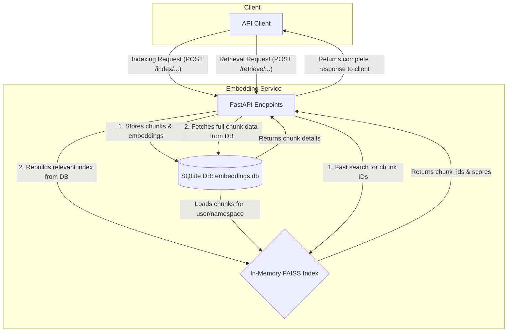

# 🧠 CVisionary Embedding Service

> **High-performance vector embedding service for semantic search and AI-powered features**

[](https://www.python.org/)
[](https://fastapi.tiangolo.com/)
[](LICENSE)

## 🚀 Overview

A high-performance FastAPI microservice for generating, storing, and retrieving vector embeddings. Powers semantic search and AI features across the CVisionary platform.

### 🔧 Key Features

- **Blazing Fast** - Optimized for low-latency vector similarity search
- **Persistent Storage** - SQLite-backed storage with in-memory FAISS indices
- **Multi-tenant** - Isolated indices per user and content type
- **Production Ready** - Robust error handling, validation, and monitoring
- **Easy Integration** - Simple REST API with OpenAPI documentation

### 🛠️ Tech Stack

| Component | Technology |
|-----------|------------|
| Web Framework | FastAPI |
| Embedding Model | `all-MiniLM-L6-v2` (384d) |
| Vector Search | FAISS |
| Database | SQLite |
| Validation | Pydantic v2 |
| Async HTTP | HTTPX |
| Testing | pytest |

## Architecture & Core Concepts

This service employs a hybrid storage model to balance persistence with high-speed retrieval. All data is permanently stored in a SQLite database, while a FAISS index is maintained in-memory for millisecond-latency searches.



### 1. Hybrid Storage Model
- **SQLite (`embeddings.db`):** This is the **source of truth**. All text chunks, metadata, and their vector embeddings are stored here permanently. If the service restarts, all data is reloaded from this database.
- **In-Memory FAISS Index:** This is a **high-speed cache** for the vectors. On startup, the service pre-loads all embeddings from SQLite into FAISS. This enables extremely fast similarity searches that would be too slow to perform directly on the database.

### 2. Namespaced Indices
To isolate different types of content, embeddings are stored in **namespaces**. Each user has their own set of indices, which are further divided into two main namespaces:
- `profile`: Contains embeddings from a full, automated scan of a user's profile (experience, skills, etc.). This data is considered relatively static.
- `resume_sections`: Specifically for embeddings from user-edited text, like a custom resume bullet point. This data is dynamic and managed on a per-section basis.

### 3. Idempotent and Atomic Operations
The indexing endpoints are designed to be **idempotent**, meaning you can call them multiple times with the same input and get a consistent result without creating duplicate data.
- **Full Profile Indexing (`/index/profile/{user_id}`):** A **destructive** operation. It deletes all previous `profile` data for the user before creating new embeddings.
- **Section Indexing (`/index/{user_id}/section`):** An "upsert" (update or insert) operation. It deletes any existing chunks with the same `section_id` before creating new ones. Consistency is guaranteed by rebuilding the user's `resume_sections` FAISS index from the database after every change.

### 4. Text Chunking
Long text fields are automatically split into smaller, semantically coherent chunks (approx. 150 words) using `nltk` to respect sentence boundaries. This improves the quality and relevance of search results.

## Getting Started

### Prerequisites
- Python 3.9+
- A virtual environment tool (e.g., `venv`, `conda`)

### Local Setup
1.  **Clone the repository:**
    ```bash
    git clone <repository-url>
    cd <repository-directory>/embedding-service
    ```

2.  **Create and activate a virtual environment:**
    ```bash
    python -m venv venv
    source venv/bin/activate  # On Windows, use `venv\Scripts\activate`
    ```

3.  **Install dependencies:**
    ```bash
    pip install -r requirements.txt
    ```
    *Note: The first time you run the application, it will download the `nltk` 'punkt' tokenizer data.*

4.  **Run the service:**
    The service is configured to run on port `8001` by default in most multi-service setups.
    ```bash
    uvicorn app:app --host 0.0.0.0 --port 8001 --reload
    ```
    The service will now be running at `http://localhost:8001`. A file named `embeddings.db` will be created in the directory.

5.  **Access the API Documentation:**
    Navigate to `http://localhost:8001/docs` in your browser.

## API Documentation

### Indexing Endpoints

#### 1. Index a Full User Profile
Re-indexes a user's entire profile from an external source. **This is a destructive operation that replaces all previous profile data for the user.**

- **Endpoint:** `POST /index/profile/{user_id}`
- **cURL Example:**
  ```bash
  curl -X POST "http://localhost:8001/index/profile/user-123"
  ```
- **Success Response (200 OK):**
  ```json
  {
    "status": "Profile for user user-123 re-indexed successfully",
    "num_chunks": 25
  }
  ```

#### 2. Index a Resume Section
Adds or updates the embeddings for a specific piece of user-edited text.

- **Endpoint:** `POST /index/{user_id}/section`
- **cURL Example:**
  ```bash
  curl -X POST "http://localhost:8001/index/user-123/section" \
  -H "Content-Type: application/json" \
  -d '{
    "section_id": "exp-bullet-45",
    "text": "Engineered a real-time data processing pipeline using Kafka and Flink, reducing analytics latency by 90%."
  }'
  ```
- **Success Response (200 OK):**
  ```json
  {
    "status": "Section exp-bullet-45 indexed successfully.",
    "section_id": "exp-bullet-45",
    "chunk_ids": ["a1b2c3d4-e5f6-...", "g7h8i9j0-k1l2-..."]
  }
  ```

#### 3. Delete a Resume Section
Removes all embeddings associated with a specific `section_id`.

- **Endpoint:** `DELETE /index/{user_id}/section/{section_id}`
- **cURL Example:**
  ```bash
  curl -X DELETE "http://localhost:8001/index/user-123/section/exp-bullet-45"
  ```
- **Success Response (200 OK):**
  ```json
  {
    "status": "Deleted 2 chunks for section exp-bullet-45.",
    "section_id": "exp-bullet-45"
  }
  ```

### Retrieval Endpoint

#### Retrieve Similar Chunks
Searches for similar chunks based on a query embedding.

- **Endpoint:** `POST /retrieve/{user_id}`
- **cURL Example (Filtered search):**
  ```bash
  curl -X POST "http://localhost:8001/retrieve/user-123" \
  -H "Content-Type: application/json" \
  -d '{
    "query_embedding": [0.01, -0.05, ..., 0.02],
    "top_k": 2,
    "index_namespace": "resume_sections",
    "filter_by_section_ids": ["exp-bullet-45", "proj-desc-12"]
  }'
  ```
- **Success Response (200 OK):**
  ```json
  {
    "results": [
      {
        "chunk_id": "some-uuid-...",
        "user_id": "user-123",
        "index_namespace": "resume_sections",
        "section_id": "exp-bullet-45",
        "source_type": "user_edited",
        "source_id": "0",
        "text": "Engineered a real-time data processing pipeline using Kafka and Flink...",
        "score": 0.934,
        "created_at": "2023-10-28T10:00:00Z"
      }
    ]
  }
  ```

### Utility Endpoints

- `POST /embed`: Generates a normalized embedding for any given text.
- `GET /health`: A simple health check endpoint.

## Architectural Considerations

### Concurrency and Scalability
The current implementation uses a global Python dictionary (`user_indices`) to hold the in-memory FAISS indices. This design is simple and very fast for a single process.
**CRITICAL:** This means the service **must be deployed as a single-worker process**. Running it with multiple workers (e.g., `uvicorn app:app --workers 4`) will lead to inconsistent state, as each worker would have its own separate, out-of-sync copy of the indices. For scaling, the in-memory state would need to be externalized to a dedicated vector database (e.g., Qdrant, Weaviate).

### Data Consistency
Consistency between the SQLite database and the in-memory FAISS index is maintained by **rebuilding the relevant FAISS index from the database on any write operation**. This is a simple and robust strategy that avoids the complexity of surgical updates to the FAISS index and prevents state drift.

## Running Tests
To ensure the quality and correctness of the service, you can run the test suite.

```bash
# Ensure test dependencies are installed from requirements.txt
pip install -r requirements.txt

# Run tests
pytest
```

## Project Structure

```
.
├── __init__.py           # Module initializer
├── app.py                # Main FastAPI application, endpoints, and orchestration
├── chunking.py           # Text chunking and extraction logic
├── db.py                 # SQLite database schema and interaction functions
├── faiss_index.py        # In-memory FAISS index management
├── model.py              # Sentence Transformer model loading and embedding generation
├── schemas.py            # Pydantic models for API request/response validation
├── requirements.txt      # Python package dependencies
└── embeddings.db         # (Generated at runtime) SQLite database file
```