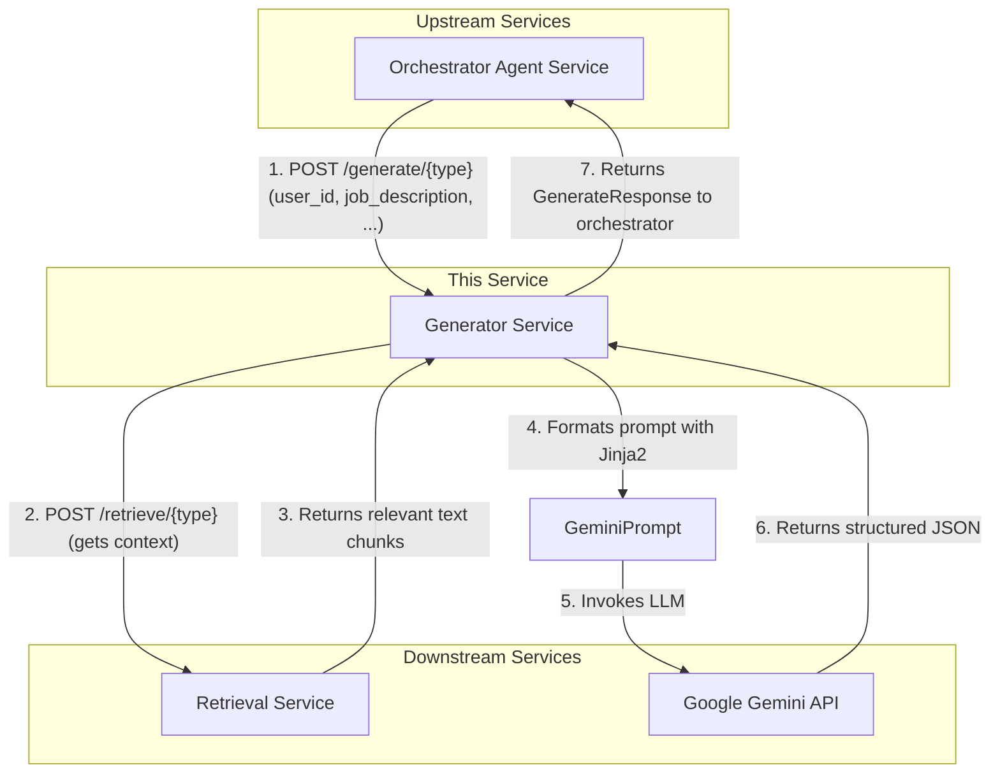

Of course. Here is a detailed README.md file for the Generator Service, following the requested style and synthesized from the provided code files.

---

# Generator Service

This is a specialized, high-performance FastAPI microservice designed exclusively for AI-powered resume content generation. It takes structured requests containing user context and a job description, queries a Large Language Model (Google Gemini), and returns precisely formatted JSON output for building or refining a resume.

## 🚀 Technology Stack

The service is built for reliability and performance using:

- **FastAPI** - High-performance, asynchronous web framework
- **Google Gemini** - State-of-the-art text and structured data generation
- **Jinja2** - Clean, maintainable prompt templating
- **HTTPX** - Efficient async communication with downstream services
- **Pydantic** - Robust data validation and API schemas

## 🏗️ Architecture Overview

The Generator Service is a backend component in a larger microservices ecosystem. It is not intended for direct user interaction. Its role is to receive generation tasks from an orchestrator (like an Agent service), gather the necessary context, and execute the generation task with an LLM.



## 🔍 Core Concepts

### 1. Task-Specific Endpoints
The service exposes two primary endpoints, each tailored for a specific generation task:
- `/generate/full`: Creates a complete, multi-section resume from scratch. It retrieves a broad set of context from the user's profile.
- `/generate/section`: Rewrites or enhances a single, specific section of a resume (e.g., "summary", "experience"). It performs a more targeted context retrieval relevant to that section.

### 2. Prompt Engineering with Jinja2
All prompts sent to the Gemini LLM are generated using **Jinja2 templates**. This separation of logic and presentation (`prompt_templates.py`) makes the prompts highly maintainable, readable, and easy to modify without changing application code. The templates are designed to give the LLM precise instructions, context, and, most importantly, a strict **JSON output format**.

### 3. Enforced JSON Output
A critical feature of this service is its reliability in producing structured data. It explicitly requests `application/json` as the `responseMimeType` from the Gemini API. Furthermore, it includes a validation step to parse the LLM's output, ensuring that only valid JSON is ever returned to the upstream service. If the LLM fails to produce valid JSON, the service raises a specific error, preventing malformed data from propagating through the system.

### 4. Contextual Retrieval
Before generating content, the service calls the downstream **Retrieval Service**. This step is crucial for providing the LLM with relevant, user-specific information (e.g., from their professional profile or other resume sections). This ensures the generated content is personalized and tailored, not generic.

## 🚀 Getting Started

### Prerequisites
- Python 3.9+
- A virtual environment tool (e.g., `venv`, `conda`)

### Local Setup
1.  **Clone the repository:**
    ```bash
    git clone <repository-url>
    cd generator-service
    ```

2.  **Create and activate a virtual environment:**
    ```bash
    python -m venv venv
    source venv/bin/activate  # On Windows, use `venv\Scripts\activate`
    ```

3.  **Install dependencies:**
    ```bash
    pip install -r requirements.txt
    ```

4.  **Configure Environment Variables:**
    Create a `.env` file in the root directory and populate it with your credentials and service URLs.
    ```env
    # .env
    # --- API Keys ---
    GEMINI_API_KEY="your-google-api-key"

    # --- LLM Configuration ---
    GEMINI_MODEL="gemini-1.5-flash"
    GENERATION_TEMPERATURE="0.7"
    GENERATION_MAX_TOKENS="2048"

    # --- Service URLs ---
    # Note: Default port for Retrieval Service is often different from the Generator
    RETRIEVAL_SERVICE_URL="http://localhost:8001" 

    # --- Other Settings ---
    DEFAULT_TOP_K="7"
    LOG_LEVEL="INFO"
    ```

5.  **Run the service:**
    ```bash
    uvicorn app:app --host 0.0.0.0 --port 8000 --reload
    ```
    The service will now be running at `http://localhost:8000`.

## 📚 API Documentation

### Generation Endpoints

#### 1. Generate a Full Resume
- **Endpoint:** `POST /generate/full`
- **Description:** Creates a complete resume from scratch by retrieving broad context about the user and applying it to a job description.
- **cURL Example:**
  ```bash
  curl -X POST "http://localhost:8000/generate/full" \
  -H "Content-Type: application/json" \
  -d '{
    "user_id": "user-123",
    "job_description": "Seeking a product manager with experience in agile methodologies and B2B SaaS products.",
    "top_k": 10
  }'
  ```
- **Success Response (`GenerateResponse`):**
  ```json
  {
    "generated_text": "{\"summary\": \"...\", \"experience\": [\"...\"], \"skills\": [\"...\"]}",
    "raw_prompt": "You are an expert resume writer...",
    "retrieval_mode": "full",
    "section_id": null
  }
  ```

#### 2. Generate or Rewrite a Resume Section
- **Endpoint:** `POST /generate/section`
- **Description:** Rewrites a specific resume section to be more impactful and tailored to the job description.
- **cURL Example:**
  ```bash
  curl -X POST "http://localhost:8000/generate/section" \
  -H "Content-Type: application/json" \
  -d '{
    "user_id": "user-123",
    "section_id": "experience",
    "job_description": "Seeking a product manager with experience in agile methodologies and B2B SaaS products.",
    "existing_text": "{\"experience\": [\"• Did some stuff.\", \"• Worked on a project.\"]}"
  }'
  ```
- **Success Response (`GenerateResponse`):**
  ```json
  {
    "generated_text": "{\"experience\": [\"• Led a cross-functional team using Agile methodologies...\", \"• Drove the product roadmap for a B2B SaaS platform...\"]}",
    "raw_prompt": "You are an expert resume writer specializing in optimizing specific resume sections...",
    "retrieval_mode": "section",
    "section_id": "experience"
  }
  ```

### Utility Endpoints

- `GET /health`: A simple health check endpoint.

## ⚠️ Error Handling
The service provides clear error responses to help with debugging and upstream service logic.
- **502 Bad Gateway:** This status is returned if there is a failure in a downstream dependency, such as the Retrieval Service or the Gemini API. The detail message will contain information about the root cause.
- **500 Internal Server Error:** This is returned for unexpected and unhandled exceptions within the Generator Service itself.

## 📁 Project Structure

```
.
├── __init__.py           # Module initializer
├── app.py                # Main FastAPI application, endpoints, and orchestration
├── llm_client.py         # Client for interacting with the Google Gemini API
├── prompt_templates.py   # Jinja2 templates for all LLM prompts
├── requirements.txt      # Python package dependencies
├── schemas.py            # Pydantic models for API request/response validation
└── utils.py              # Utility functions for calling the Retrieval Service
```