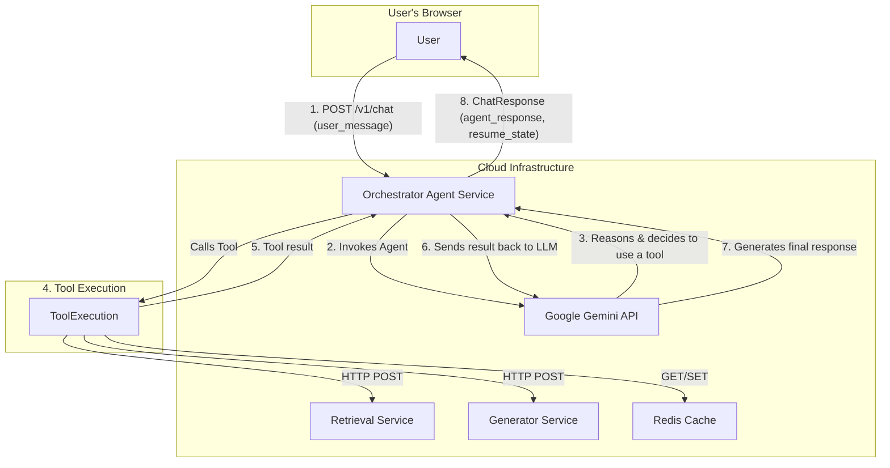

# Orchestrator Agent Service

This is a stateful, AI-powered microservice that acts as the central "brain" for a resume-building assistant. It orchestrates complex tasks by interpreting user requests, managing conversation state, and delegating work to specialized backend services.

## Technology Stack

The service is built on a modern, robust technology stack:

- **FastAPI**: High-performance, asynchronous web framework
- **LangChain**: For building and managing the core LLM-powered agent
- **Google Gemini**: Powers the advanced reasoning and tool-using capabilities
- **Redis**: Handles durable and fast session management
- **Pydantic**: Provides robust data validation and API schemas
- **HTTPX**: Enables asynchronous communication with other services

## Architecture Overview

The Orchestrator Service is the central coordinator in a microservices ecosystem. It receives user requests, uses an LLM agent to decide on a course of action, and calls other services to execute specific tasks like data retrieval or content generation.



## 🔍 Core Concepts

### 1. The LangChain Agent
The service's intelligence comes from a LangChain agent powered by the `gemini-1.5-pro-latest` model. The agent's behavior is strictly defined by a `SYSTEM_PROMPT` that instructs it to act as an expert resume assistant. It follows a clear process: understand the user's goal, gather necessary information using tools, generate content, save its work, and respond to the user.

### 2. Stateful Session Management
A conversation about building a resume is inherently stateful. This service uses **Redis** to manage two critical pieces of information for each `session_id`:
- **Conversation History:** A turn-by-turn log of the user and agent messages, managed by `RedisChatMessageHistory`. This gives the agent the context of the ongoing conversation.
- **Session Context:** A JSON object stored in Redis that acts as the **source of truth** for the session. It contains the `user_id`, the target `job_description`, and the `resume_state`—a complete, up-to-date JSON representation of the resume being built.

### 3. The ToolBox
The agent's capabilities are defined by the set of tools it can use. These tools are methods within the `ToolBox` class and are the bridge between the agent's reasoning and the outside world.
- `get_current_resume_section_tool`: Fetches the current text of a resume section from the `resume_state` in Redis.
- `retrieve_context_tool`: Calls the external **Retrieval Service** to find relevant information from the user's professional profile to inform the writing process.
- `generate_text_tool`: Calls the external **Generator Service** to create new or revised text for a resume section.
- `update_resume_in_memory_tool`: **This is a critical step.** After generating content, the agent **must** use this tool to save the new text back into the `resume_state` in Redis. This ensures the resume is always consistent and up-to-date for subsequent edits.

## 🚀 Getting Started

### Prerequisites
- Python 3.9+
- A virtual environment tool (e.g., `venv`, `conda`)
- Access to a running Redis instance.

### Local Setup
1.  **Clone the repository:**
    ```bash
    git clone <repository-url>
    cd orchestrator-service
    ```

2.  **Create and activate a virtual environment:**
    ```bash
    python -m venv venv
    source venv/bin/activate  # On Windows, use `venv\Scripts\activate`
    ```

3.  **Install dependencies:**
    ```bash
    pip install -r requirements.txt
    ```

4.  **Configure Environment Variables:**
    Create a `.env` file in the root directory and populate it with your credentials and service URLs.
    ```env
    # .env
    GEMINI_API_KEY="your-google-api-key"
    REDIS_URL="redis://localhost:6379"
    RETRIEVAL_SERVICE_URL="http://localhost:8001" # Or your retrieval service port
    GENERATION_SERVICE_URL="http://localhost:8002" # Or your generator service port
    ```

5.  **Run the service:**
    ```bash
    uvicorn app:app --host 0.0.0.0 --port 8000 --reload
    ```
    The service will now be running at `http://localhost:8000`.

## 📚 API Documentation

### Chat Endpoint

#### `POST /v1/chat`
This is the main endpoint for all user interactions with the agent. It's stateful and relies on a `session_id`.

- **Description:** Sends a user message to the agent and receives a conversational response and the updated resume state.
- **Note:** The `user_id` and `job_description` fields are **required for the first message** of a new session to initialize the context. They can be omitted for all subsequent messages in that session.

- **cURL Example (New Session):**
  ```bash
  curl -X POST "http://localhost:8000/v1/chat" \
  -H "Content-Type: application/json" \
  -d '{
    "session_id": "session-xyz-789",
    "user_message": "Help me create a resume for this job.",
    "user_id": "user-123",
    "job_description": "We are seeking a Senior Python Developer with experience in FastAPI and cloud services..."
  }'
  ```

- **cURL Example (Follow-up Message):**
  ```bash
  curl -X POST "http://localhost:8000/v1/chat" \
  -H "Content-Type: application/json" \
  -d '{
    "session_id": "session-xyz-789",
    "user_message": "Great, now rewrite my summary section."
  }'
  ```

- **Success Response (`ChatResponse`):**
  ```json
  {
    "agent_response": "I have drafted a new summary for you based on the job description and your profile. I've saved this update to your resume.",
    "session_id": "session-xyz-789",
    "resume_state": {
      "summary": "A highly motivated Senior Python Developer with 8 years of experience...",
      "experience": [
        {
          "title": "Lead Developer",
          "company": "Tech Solutions Inc.",
          "duties": ["..."]
        }
      ]
    }
  }
  ```

### Utility Endpoints

- `GET /health`: A simple health check endpoint that verifies the service is running and can connect to Redis.

## 🔄 Agent Logic Flow: An Example

To understand the service's behavior, consider a user asking: *"Rewrite my experience section to highlight my leadership skills."*

1.  **User Request**: `POST /v1/chat` with the user's message.
2.  **Agent Invocation**: The `chat_endpoint` invokes the agent.
3.  **Agent Reasoning (Step 1)**: The agent determines it needs the *current* content of the 'experience' section.
4.  **Tool Call (1)**: It calls `get_current_resume_section_tool(section_id='experience')`. The tool fetches the data from the `resume_state` in Redis and returns it.
5.  **Agent Reasoning (Step 2)**: The agent now has the existing text. It determines it also needs more context about the user's leadership roles from their professional profile.
6.  **Tool Call (2)**: It calls `retrieve_context_tool(section_id='experience')`. This triggers an HTTP request to the **Retrieval Service**, which returns relevant text chunks.
7.  **Agent Reasoning (Step 3)**: The agent now has all the necessary information.
8.  **Tool Call (3)**: It calls `generate_text_tool(section_id='experience', existing_text='...')`. This triggers an HTTP request to the **Generator Service**, which performs the rewrite and returns the new text.
9.  **Agent Reasoning (Step 4)**: The generation was successful. The `SYSTEM_PROMPT` strictly requires the agent to save its work.
10. **Tool Call (4)**: It calls `update_resume_in_memory_tool(section_id='experience', new_content_json='...')`. This tool updates the `resume_state` in Redis.
11. **Final Response**: The agent formulates a user-friendly message confirming the action and returns it, along with the complete, updated `resume_state`.

## ⚙️ External Dependencies

This service is designed to work as part of a larger system and has several key external dependencies:

- **Redis**: A running Redis instance is **required** for session management.
- **Retrieval Service**: A separate microservice responsible for semantic search. Must be accessible at the URL defined by `RETRIEVAL_SERVICE_URL`.
- **Generator Service**: A separate microservice responsible for high-quality text generation. Must be accessible at the URL defined by `GENERATION_SERVICE_URL`.
- **Google Cloud / Gemini API**: Requires a valid `GEMINI_API_KEY` for the agent's core LLM to function.