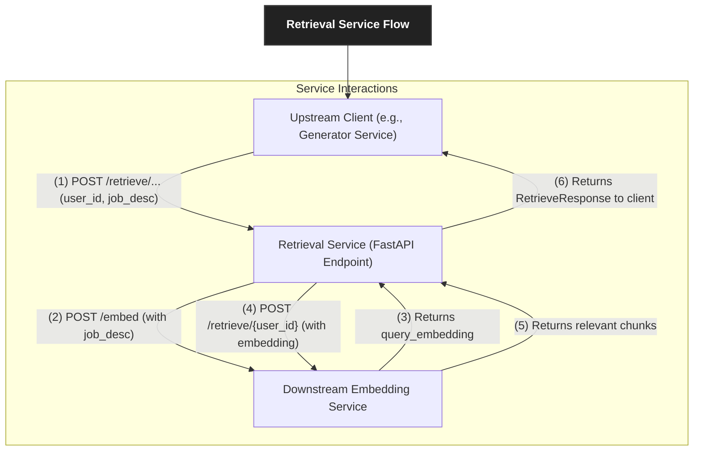

# CVisionary Retrieval Service

This is a high-performance FastAPI microservice designed to act as an intelligent intermediary for context retrieval. It orchestrates calls to the downstream **Embedding Service** to fetch semantically relevant text chunks, which are then used by upstream services (like a Generator Service) to build or edit resumes.

## 🚀 Technology Stack

The service is built with a focus on robustness, observability, and clear separation of concerns using:

- **FastAPI** - High-performance, asynchronous web framework
- **Pydantic** - Robust data validation and API schemas
- **HTTPX** - Efficient async communication with downstream services
- **Structured Logging** - Machine-parsable logs for monitoring and debugging

## 🏗️ Architecture & Core Concepts

This service sits between a client (e.g., a Generation Service) and the Embedding Service. Its main responsibilities are to abstract complexity and provide a resilient, task-oriented API.



### 1. Abstraction Layer
The Retrieval Service hides the complexity of the Embedding Service's API. A client doesn't need to know about `index_namespace` or the multi-step process of generating a query embedding. The client simply asks for *what* it wants ("full context" or "section context"), and this service handles *how* to get it.

### 2. Two-Step Retrieval Orchestration
For every request, the service performs a two-step orchestration:
1.  **Embed:** It first calls the Embedding Service to convert the incoming `job_description` text into a vector embedding.
2.  **Retrieve:** It then uses this newly generated embedding to query the Embedding Service for the most similar text chunks from the user's profile.

### 3. Resilience and Error Handling
Communication with the downstream Embedding Service is wrapped in a **retry mechanism with exponential backoff**. This makes the system more robust against transient network issues or temporary server-side failures (5xx errors) from the dependency. It also provides structured JSON error responses for all exceptions.

## 🚀 Getting Started

### Prerequisites
- Python 3.9+
- A running instance of the **CVisionary Embedding Service**.

### Local Setup
1.  **Clone the repository and navigate to the service directory:**
    ```bash
    git clone <repository-url>
    cd <repository-directory>/retrieval_service
    ```

2.  **Create and activate a virtual environment:**
    ```bash
    python -m venv venv
    source venv/bin/activate  # On Windows, use `venv\Scripts\activate`
    ```

3.  **Install dependencies:**
    ```bash
    pip install -r requirements.txt
    ```

4.  **Configure Environment Variables:**
    Create a `.env` file in the `retrieval_service` directory or set the environment variables in your shell.
    ```env
    # .env
    # REQUIRED: The full URL of the running Embedding Service
    EMBEDDING_SERVICE_URL="http://localhost:8001"

    # OPTIONAL: The default number of chunks to retrieve if not specified
    DEFAULT_TOP_K="5"

    # OPTIONAL: Set to "DEBUG" for more verbose logging
    LOG_LEVEL="INFO"
    ```

5.  **Run the service:**
    The service is configured to run on port `8002` by default in most multi-service setups.
    ```bash
    uvicorn app:app --host 0.0.0.0 --port 8002 --reload
    ```
    The service will now be running at `http://localhost:8002`.

6.  **Access the API Documentation:**
    Navigate to `http://localhost:8002/docs` in your browser.

## 📚 API Documentation

### Retrieval Endpoints

#### 1. Retrieve Full Resume Context
Fetches the most relevant chunks from a user's entire profile based on a job description. This queries the `profile` namespace in the Embedding Service.

-   **Endpoint:** `POST /retrieve/full`
-   **cURL Example:**
    ```bash
    curl -X POST "http://localhost:8002/retrieve/full" \
    -H "Content-Type: application/json" \
    -d '{
      "user_id": "user-123",
      "job_description": "We are looking for a senior software engineer with experience in Python, FastAPI, and cloud-native technologies.",
      "top_k": 3
    }'
    ```

#### 2. Retrieve Section-Specific Context
Fetches the most relevant chunks filtered by a specific `section_id`. This queries the `resume_sections` namespace in the Embedding Service.

-   **Endpoint:** `POST /retrieve/section`
-   **cURL Example:**
    ```bash
    curl -X POST "http://localhost:8002/retrieve/section" \
    -H "Content-Type: application/json" \
    -d '{
      "user_id": "user-123",
      "section_id": "exp-bullet-45",
      "job_description": "We need someone who can engineer real-time data processing pipelines.",
      "top_k": 2
    }'
    ```

-   **Success Response (200 OK for both endpoints):**
    The response is a `RetrieveResponse` object containing a list of `ChunkItem` objects.
    ```json
    {
      "results": [
        {
          "chunk_id": "a1b2c3d4-e5f6-g7h8-i9j0-k1l2m3n4o5p6",
          "user_id": "user-123",
          "index_namespace": "profile",
          "section_id": null,
          "source_type": "experience",
          "source_id": "exp-1",
          "text": "Led a team of five engineers in the development of a cloud-native SaaS platform using Python and FastAPI.",
          "score": 0.912,
          "created_at": "2023-10-28T12:00:00Z"
        }
      ]
    }
    ```

### Utility Endpoints

-   `GET /health`: A simple health check endpoint for service monitoring. Returns `{"status": "ok", "service": "retrieval"}`.
-   `GET /`: Root endpoint with basic service information.

## ⚠️ Error Handling
The service provides structured JSON error responses for easier debugging by clients.

-   **400 Bad Request:** The request body is invalid (e.g., an empty `user_id` or `job_description`).
-   **404 Not Found:** The requested user was not found in the downstream Embedding Service.
-   **422 Unprocessable Entity:** The request body is syntactically correct but semantically invalid (e.g., `top_k` is out of the allowed range).
-   **502 Bad Gateway:** The Retrieval Service could not get a valid response from the downstream Embedding Service after retries.
-   **500 Internal Server Error:** An unexpected error occurred within the Retrieval Service itself.

**Example Error Response:**
```json
{
  "error": "Failed to retrieve full context",
  "status_code": 502,
  "path": "/retrieve/full"
}
```

## 🧪 Running Tests
The service includes a suite of unit tests that mock the downstream Embedding Service.

1.  **Install test dependencies (if not already installed):**
    ```bash
    pip install pytest pytest-asyncio
    ```

2.  **Run the test suite from the service's root directory:**
    ```bash
    pytest
    ```

## 📁 Project Structure

```
retrieval_service/
├── app.py                # Main FastAPI application, endpoints, and lifecycle
├── schemas.py            # Pydantic models for API request/response validation
├── utils.py              # Logic for communicating with the Embedding Service
├── requirements.txt      # Python package dependencies
├── README.md             # This file
└── tests/                # Unit tests for the service
    └── ...
```
