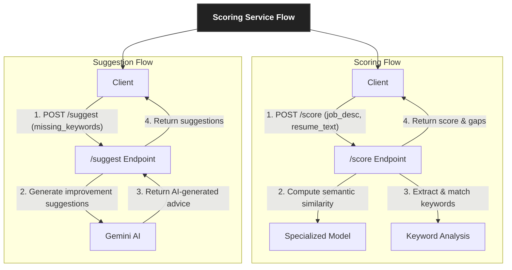

# Scoring Service

A specialized FastAPI microservice designed to perform ATS-style analysis of resumes against job descriptions. This service provides a quantitative match score, identifies missing keywords, and offers actionable suggestions for improvement.

## Features

- **Semantic Matching**: Uses a fine-tuned Sentence Transformer model to calculate semantic similarity between resumes and job descriptions
- **Keyword Analysis**: Extracts and matches key skills and requirements
- **AI-Powered Suggestions**: Generates actionable advice using Google's Gemini API
- **RESTful API**: Easy integration with other services via HTTP endpoints
- **Container Ready**: Docker support for easy deployment

## Technology Stack

- **FastAPI**: High-performance, asynchronous web framework
- **Sentence Transformers**: `anass1209/resume-job-matcher-all-MiniLM-L6-v2` model for semantic similarity
- **Google Gemini**: For generating intelligent, actionable suggestions
- **Pydantic**: Data validation and API schema definitions
- **Docker**: Containerization for consistent deployments

## Architecture & Core Concepts

The Scoring Service is a self-contained analytical tool that provides on-demand resume analysis. It's designed to be called by other services or frontend applications and doesn't maintain persistent storage, instead relying on a pre-trained model and external LLM for its core functionality.

### Core Components

#### 1. Two-Phase Analysis

The service operates through two primary endpoints that work in tandem:

- **`/score` Endpoint**  
  Performs the core analysis by:
  - Calculating semantic similarity between resume and job description
  - Extracting and matching keywords
  - Identifying skill gaps and missing requirements
  - Returning a structured response with match score and missing keywords

- **`/suggest` Endpoint**  
  Enhances the analysis by:
  - Taking the list of missing keywords
  - Generating human-readable, actionable suggestions
  - Providing specific recommendations for resume improvement

#### 2. Specialized Scoring Model

Unlike general-purpose models, this service uses a specialized model (`anass1209/resume-job-matcher-all-MiniLM-L6-v2`) fine-tuned specifically for resume-job description matching. This ensures:

- More accurate semantic matching in the recruitment context
- Better understanding of technical skills and qualifications
- Nuanced scoring that reflects real-world hiring requirements

#### 3. Keyword-Based Gap Analysis

The service combines deep learning with traditional keyword analysis:

- Extracts key technical and soft skills from job descriptions
- Performs exact and fuzzy matching against resume content
- Identifies both present and missing skills
- Provides clear, actionable feedback on skill gaps

### System Flow



## 🚀 Getting Started

### Prerequisites

- Python 3.9+
- [Git](https://git-scm.com/)
- [pip](https://pip.pypa.io/en/stable/installation/)
- [Google Gemini API Key](https://ai.google.dev/)

### 📥 Installation

1. **Clone the repository**
   ```bash
   git clone https://github.com/your-org/CVisionary.git
   cd CVisionary/AI_Services/scoring_service
   ```

2. **Set up a virtual environment**
   ```bash
   # Create and activate virtual environment
   python -m venv venv
   
   # On Windows:
   .\venv\Scripts\activate
   
   # On macOS/Linux:
   source venv/bin/activate
   ```

3. **Install dependencies**
   ```bash
   pip install -r requirements.txt
   ```

4. **Configure environment variables**
   Create a `.env` file in the `scoring_service` directory:
   ```env
   # Required for AI suggestions
   GEMINI_API_KEY="your-google-api-key-here"
   
   # Optional: Set log level (DEBUG, INFO, WARNING, ERROR, CRITICAL)
   LOG_LEVEL="INFO"
   ```

### 🏃 Running the Service

Start the FastAPI development server:

```bash
uvicorn app:app --host 0.0.0.0 --port 8004 --reload
```

The service will be available at:  
📄 API Documentation: http://localhost:8004/docs  
📊 OpenAPI Schema: http://localhost:8004/redoc

### 🐳 Docker Support

Alternatively, you can run the service using Docker:

```bash
# Build the Docker image
docker build -t scoring-service .

# Run the container
docker run -p 8004:8004 --env-file .env scoring-service
```

## 📚 API Documentation

Explore the interactive API documentation at `http://localhost:8004/docs` when the service is running.

### 🔍 Core Endpoints

#### 1. Score Resume

Analyzes a resume against a job description and returns a match score with missing keywords.

- **Endpoint:** `POST /score`
- **Request Body (JSON):**
  ```json
  {
    "job_description": "string",
    "resume_text": "string"
  }
  ```

- **Example Request:**
  ```bash
  curl -X 'POST' \
    'http://localhost:8004/score' \
    -H 'Content-Type: application/json' \
    -d '{
      "job_description": "We are looking for a Senior Python Developer with 5+ years of experience in building scalable web applications using FastAPI and AWS. Experience with Docker, Kubernetes, and CI/CD pipelines is a plus.",
      "resume_text": "Senior Software Engineer with 6 years of experience. Proficient in Python, Django, and cloud services. Led a team to develop microservices using Docker and AWS. Strong problem-solving skills and experience with Agile methodologies."
    }'
  ```

- **Success Response (200 OK):**
  ```json
  {
    "match_score": 0.78,
    "missing_keywords": ["FastAPI", "Kubernetes", "CI/CD"]
  }
  ```

#### 2. Get Suggestions

Generates personalized suggestions for improving a resume based on missing keywords.

- **Endpoint:** `POST /suggest`
- **Request Body (JSON):**
  ```json
  {
    "missing_keywords": ["string"]
  }
  ```

- **Example Request:**
  ```bash
  curl -X 'POST' \
    'http://localhost:8004/suggest' \
    -H 'Content-Type: application/json' \
    -d '{
      "missing_keywords": ["FastAPI", "Kubernetes", "CI/CD"]
    }'
  ```

- **Success Response (200 OK):**
  ```json
  {
    "suggestions": [
      "Consider adding a project that demonstrates your experience with FastAPI, such as building a RESTful API with authentication and database integration.",
      "If you have experience with container orchestration, be sure to highlight any work with Kubernetes, including any deployments or scaling configurations you've managed.",
      "Mention any experience with CI/CD pipelines, including tools like GitHub Actions, Jenkins, or GitLab CI, and describe how you've automated testing and deployment processes."
    ]
  }
  ```

### ⚙️ Utility Endpoints

#### Health Check
- **Endpoint:** `GET /health`
- **Response:**
  ```json
  {
    "status": "healthy",
    "service": "scoring-service",
    "version": "1.0.0",
    "timestamp": "2025-06-17T08:15:30Z"
  }
  ```

### 🔄 Error Handling

All endpoints return standard HTTP status codes along with a JSON error object:

```json
{
  "detail": "Error message describing the issue"
}
```

Common error responses include:
- `400 Bad Request`: Invalid input data
- `422 Unprocessable Entity`: Validation error
- `500 Internal Server Error`: Server-side error
- `503 Service Unavailable`: External service (e.g., Gemini API) unavailable

## 🏗️ Project Structure

```
scoring_service/
├── .env.example          # Example environment variables
├── .gitignore            # Git ignore file
├── Dockerfile            # Docker configuration
├── README.md             # This documentation
├── requirements.txt      # Python package dependencies
│
├── app.py                # Main FastAPI application and endpoints
├── feature_extractor.py  # Logic for keyword extraction and comparison
├── model_inference.py    # Handles loading and running the scoring model
├── suggestion_client.py  # Client for calling the Gemini API for suggestions
├── schemas.py            # Pydantic models for API request/response validation
│
├── tests/               # Test suite
│   ├── __init__.py
│   ├── conftest.py
│   ├── test_api.py
│   ├── test_feature_extractor.py
│   └── test_model_inference.py
│
└── utils/               # Utility modules
    ├── __init__.py
    └── logging_config.py # Logging configuration
```

## 🤝 Contributing

We welcome contributions to improve the Scoring Service! Here's how you can help:

### Setting Up for Development

1. Fork the repository and clone your fork
2. Set up a development environment:
   ```bash
   python -m venv venv
   source venv/bin/activate  # or `venv\Scripts\activate` on Windows
   pip install -r requirements-dev.txt  # Includes testing and linting tools
   ```

### Development Workflow

1. Create a new branch for your feature or bugfix:
   ```bash
   git checkout -b feature/your-feature-name
   ```
2. Make your changes and ensure tests pass:
   ```bash
   # Run tests
   pytest
   
   # Run with coverage
   pytest --cov=scoring_service tests/
   
   # Run linter
   flake8 .
   
   # Run type checking
   mypy .
   ```
3. Update documentation if needed
4. Commit your changes with a descriptive message
5. Push to your fork and open a pull request

### Code Style

- Follow [PEP 8](https://www.python.org/dev/peps/pep-0008/) for Python code
- Use type hints throughout the codebase
- Keep functions small and focused
- Write docstrings for all public functions and classes
- Include tests for new features and bug fixes

## 📄 License

This project is licensed under the MIT License - see the [LICENSE](LICENSE) file for details.

## 🙏 Acknowledgments

- [Sentence Transformers](https://www.sbert.net/) for the semantic matching model
- [Google Gemini](https://ai.google.dev/) for the AI-powered suggestions
- [FastAPI](https://fastapi.tiangolo.com/) for the web framework
- All contributors who helped improve this project
```